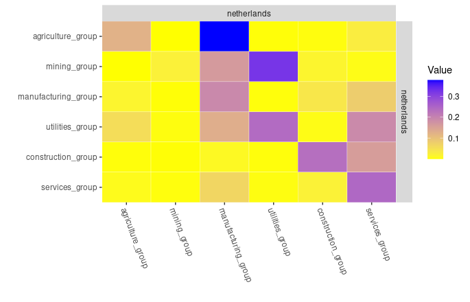
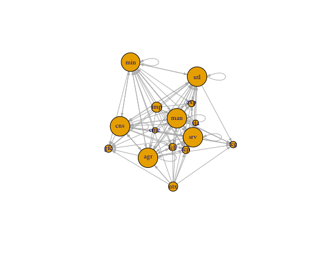

<!-- README.md is generated from README.Rmd. Please edit that file -->

# Easy test result

<!-- badges: start -->
<!-- badges: end -->

## the task

install packages `iotables` and `ioanalysis`; take one table from
`iotables` as an example and run the economic analysis available in
`ioanalysis`; install package `igraph` and use it to obtain the
centrality measures for the network from this example table.

## iotables package

I used the netherlands_2006 table

## doing some analysis with `ioanalysis` package

### the linkage table

    #> $netherlands
    #>                       BL.tot   FL.tot
    #> agriculture_group   1.757069 1.854037
    #> mining_group        1.215959 2.010565
    #> manufacturing_group 1.615374 1.511504
    #> utilities_group     1.896194 2.111510
    #> construction_group  1.897534 1.654501
    #> services_group      1.487015 1.534568

### the heatmap visualization for the coefficients matrix of the domestic intermediate matrix

## graph analysis and visualization with `igraph` package

### summation of the graph (only the 10 first rows)

<table>
<thead>
<tr>
<th style="text-align:right;">
from
</th>
<th style="text-align:right;">
to
</th>
<th style="text-align:right;">
weight
</th>
<th style="text-align:left;">
from_name
</th>
<th style="text-align:right;">
from_degree
</th>
<th style="text-align:right;">
from_Eigen
</th>
<th style="text-align:right;">
from_betweennes
</th>
<th style="text-align:left;">
to_name
</th>
<th style="text-align:right;">
to_degree
</th>
<th style="text-align:right;">
to_Eigen
</th>
<th style="text-align:right;">
to_betweennes
</th>
</tr>
</thead>
<tbody>
<tr>
<td style="text-align:right;">
1
</td>
<td style="text-align:right;">
1
</td>
<td style="text-align:right;">
2731
</td>
<td style="text-align:left;">
agriculture_group
</td>
<td style="text-align:right;">
21
</td>
<td style="text-align:right;">
0.0323583
</td>
<td style="text-align:right;">
31
</td>
<td style="text-align:left;">
agriculture_group
</td>
<td style="text-align:right;">
21
</td>
<td style="text-align:right;">
0.0323583
</td>
<td style="text-align:right;">
31
</td>
</tr>
<tr>
<td style="text-align:right;">
1
</td>
<td style="text-align:right;">
2
</td>
<td style="text-align:right;">
3
</td>
<td style="text-align:left;">
agriculture_group
</td>
<td style="text-align:right;">
21
</td>
<td style="text-align:right;">
0.0323583
</td>
<td style="text-align:right;">
31
</td>
<td style="text-align:left;">
mining_group
</td>
<td style="text-align:right;">
20
</td>
<td style="text-align:right;">
0.0090525
</td>
<td style="text-align:right;">
69
</td>
</tr>
<tr>
<td style="text-align:right;">
1
</td>
<td style="text-align:right;">
3
</td>
<td style="text-align:right;">
8260
</td>
<td style="text-align:left;">
agriculture_group
</td>
<td style="text-align:right;">
21
</td>
<td style="text-align:right;">
0.0323583
</td>
<td style="text-align:right;">
31
</td>
<td style="text-align:left;">
manufacturing_group
</td>
<td style="text-align:right;">
21
</td>
<td style="text-align:right;">
0.3339807
</td>
<td style="text-align:right;">
0
</td>
</tr>
<tr>
<td style="text-align:right;">
1
</td>
<td style="text-align:right;">
4
</td>
<td style="text-align:right;">
36
</td>
<td style="text-align:left;">
agriculture_group
</td>
<td style="text-align:right;">
21
</td>
<td style="text-align:right;">
0.0323583
</td>
<td style="text-align:right;">
31
</td>
<td style="text-align:left;">
utilities_group
</td>
<td style="text-align:right;">
21
</td>
<td style="text-align:right;">
0.0129047
</td>
<td style="text-align:right;">
26
</td>
</tr>
<tr>
<td style="text-align:right;">
1
</td>
<td style="text-align:right;">
5
</td>
<td style="text-align:right;">
59
</td>
<td style="text-align:left;">
agriculture_group
</td>
<td style="text-align:right;">
21
</td>
<td style="text-align:right;">
0.0323583
</td>
<td style="text-align:right;">
31
</td>
<td style="text-align:left;">
construction_group
</td>
<td style="text-align:right;">
21
</td>
<td style="text-align:right;">
0.1067068
</td>
<td style="text-align:right;">
7
</td>
</tr>
<tr>
<td style="text-align:right;">
1
</td>
<td style="text-align:right;">
6
</td>
<td style="text-align:right;">
615
</td>
<td style="text-align:left;">
agriculture_group
</td>
<td style="text-align:right;">
21
</td>
<td style="text-align:right;">
0.0323583
</td>
<td style="text-align:right;">
31
</td>
<td style="text-align:left;">
services_group
</td>
<td style="text-align:right;">
21
</td>
<td style="text-align:right;">
0.8639840
</td>
<td style="text-align:right;">
0
</td>
</tr>
<tr>
<td style="text-align:right;">
1
</td>
<td style="text-align:right;">
11
</td>
<td style="text-align:right;">
962
</td>
<td style="text-align:left;">
agriculture_group
</td>
<td style="text-align:right;">
21
</td>
<td style="text-align:right;">
0.0323583
</td>
<td style="text-align:right;">
31
</td>
<td style="text-align:left;">
final_consumption_private
</td>
<td style="text-align:right;">
8
</td>
<td style="text-align:right;">
1.0000000
</td>
<td style="text-align:right;">
0
</td>
</tr>
<tr>
<td style="text-align:right;">
1
</td>
<td style="text-align:right;">
12
</td>
<td style="text-align:right;">
962
</td>
<td style="text-align:left;">
agriculture_group
</td>
<td style="text-align:right;">
21
</td>
<td style="text-align:right;">
0.0323583
</td>
<td style="text-align:right;">
31
</td>
<td style="text-align:left;">
final_consumption_households
</td>
<td style="text-align:right;">
8
</td>
<td style="text-align:right;">
0.9790654
</td>
<td style="text-align:right;">
0
</td>
</tr>
<tr>
<td style="text-align:right;">
1
</td>
<td style="text-align:right;">
13
</td>
<td style="text-align:right;">
62
</td>
<td style="text-align:left;">
agriculture_group
</td>
<td style="text-align:right;">
21
</td>
<td style="text-align:right;">
0.0323583
</td>
<td style="text-align:right;">
31
</td>
<td style="text-align:left;">
final_consumption_government
</td>
<td style="text-align:right;">
7
</td>
<td style="text-align:right;">
0.6650729
</td>
<td style="text-align:right;">
0
</td>
</tr>
<tr>
<td style="text-align:right;">
1
</td>
<td style="text-align:right;">
14
</td>
<td style="text-align:right;">
567
</td>
<td style="text-align:left;">
agriculture_group
</td>
<td style="text-align:right;">
21
</td>
<td style="text-align:right;">
0.0323583
</td>
<td style="text-align:right;">
31
</td>
<td style="text-align:left;">
gross_fixed_capital_formation
</td>
<td style="text-align:right;">
8
</td>
<td style="text-align:right;">
0.1827973
</td>
<td style="text-align:right;">
0
</td>
</tr>
</tbody>
</table>

### graph visualization with plot

